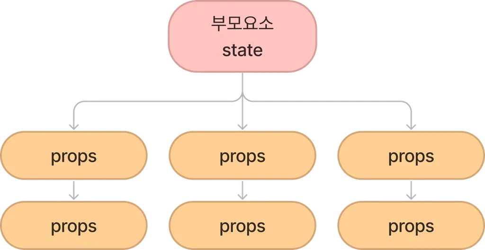
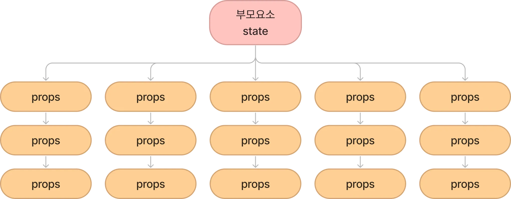

# useContext란?
## 컨텍스트 정의

: 컴포넌트 간의 데이터(state)를 전달하려면 props를 이용하여 전달해야만 했습니다. props를 통한 전달 방법은, 부모 요소에서 자식 요소로만 진행되며 부모-자식 컴포넌트의 깊이가 깊어질 수록 데이터를 사용하지 않는 컴포넌트라도 자식 컴포넌트가 사용한다면 props를 넘겨줘야 하는 번거로움이 있습니다.



비교적 작은 규모의 프로젝트의 경우 데이터를 넘겨줄 때에 간단한 작업으로 효율적으로 가능하지만, 규모가 있는 프로젝트일수록 컴포넌트의 깊이가 깊어지고 데이터의 전달이 많아지게 될 겁니다. props가 필요한 자식 컴포넌트가 아니라도, 그 아래 자식 컴포넌트에게 전달하기 위한 props를 전달해야 하는 불필요하고 반복적인 작업이 이루어지게 될겁니다.
예시는 useContext02와 같습니다.



이상과 같은 현상을 props drilling이라고 하는데, 컨텍스트는 리액트 컴포넌트 트리 안에서 데이터를 공유할 수 있도록 고안된 방법이기 때문에 props drilling을 막을 수 있습니다.

그 예시가 useContext03과 같습니다.


전역적으로 데이터를 관리하고 사용할 수 있는 방법이 있기 때문에, props를 넘겨주는 방식을 절대 사용하지 않고 컨텍스트만 쓰면 되겠다 싶으실 수도 있는데, 규모가 작은 프로젝트라면 props를 사용하는 것이 더 효율적일 수 있으니 둘 중에 상황에 따라 선택하셔야 합니다.

## Context 종류

: 리액트에서 공식적으로 Context API를 통해 useContext Hook을 사용하기 전에는 의미없는 props drilling을 피하기 위해 Context API가 아닌 다른 라이브러리를 사용했었습니다. MobX, xstate, recoil, zustand 등 상태 관리를 위한 여러 라이브러리가 존재하며, Context API에서 제공하는 기능 외의 기능을 활용해야 하는지 확인하고 효율성을 따져 라이브러리를 선택해야 합니다(저는 recoil을 위주로 수업하게 될 듯 합니다).

규모가 큰 프로젝트에서 대량의 데이터를 저장하고 싶을 때 Context API보다 넓은 범용성을 가진 다른 라이브러리가 더 효율적으로 쓰이며, side effect(보조 효과), memoization(메모이제이션), data serialzation 등의 기능을 활용해야 할 때 다른 라이브러를 선택하는 편입니다.

다른 라이브러리 들이 여러 기능과 범용성에서 이점을 갖게 되니까 리액트에서도 공식적으로 React.createContext와 useContext가 등장하게 되었고, 활발하게 사용되고 있습니다.

# useContext 기본 사용법

기존의 context API를 사용하여 데이터를 전달하는 방법 / useContext를 사용하는 방법을 나누어 설명할 예정

## 기존의 context API 사용하는 사례

: contextAPI는 Context.Provider 와 Context.Consumer를 사용합니다. 데이터를 전달해주고 싶은 컨텍스트를 Context.Provier로 감싸줍니다.


```jsx
import Customer1 from './Customer1';
import Customer2 from './Customer2';

function App() {
  return (
    <MenuContext.Provier
      value={{
        아메리카노: "3500",
        카페라떼: "4000",
      }}
    >
      <Customer1 />
      <Customer2 />
    </MenuContext.Provier>
  );
}

export default App;
```
App.jsx 작성한 부분 -> MenuContext / Customer1 / Customer2가 있어야 한다는 점을 알 수 있습니다.

Context.jsx

```jsx
import { createContext } from "react";
export const MenuContext = createContext(null);
```
Context는 따로 파일을 생성하여 사용하도록 했습니다. createContext(initialValue) 형태로 작성합니다. 단 이 초기값은 Context.Provider를 통해 value값을 설정해주지 않았을 때 작동합니다.

```jsx
import { MenuContext } from "./Context";
export default function Customer1() {
  return(
    <MenuContext.Consumer>
      {(price) => <div>1번 고객님은 {price.아메리카노}원을 지불합니다.</div>}
    </MenuContext.Consumer>
  );
}
```
이상의 방법이 기존의 context API를 사용하는 방법이었습니다.


## useContext를 사용하는 방법

: useContext를 사용했을 때 이상의 방법과의 작성 차이점을 확인합니다.

Customer01.jsx
Customer02.jsx

```jsx
import { useContext } from "react";
import { MenuContext } from "./Context";
export default function Costomer02() {
  const price = useContext(MenuContext);
  return <div>2번 고객님은 {price.카페라떼}원을 지불합니다.</div>
}
```
useContext를 사용했을 때 MenuContext.Consumer를 사용하지 않았다는데 주목하셔야 합니다 -> App.jsx에서도 MenuContext.Provier를 사용하지 않겠네요.

App16.jsx를 생성하겠습니다.

```jsx
import Customer01 from "./Customer01";
import Customer02 from "./Customer02";

function App() {
  return(
    <>
      <Customer01 />
      <Customer02 />
    </>
  );
}

export default App;
```

MenuContext.Provider의 복잡한 작성 예시를 따를 필요없이, 그냥 fragment를 사용해서 작성할 수 있다는 차이점이 있습니다.

해당 경우 Context.jsx도 수정을 해야합니다.

```jsx
// import { createContext } from "react";
// export const MenuContext = createContext(null);

// contextAPI 활용 사례 ↑
// useContext 활용 사례 ↓

import { createContext } from "react";
const Menu = {
  아메리카노: "3500",
  카페라떼: "4000",
}

export default MenuContext = createContext(Menu);
```

경로가 꼬일 수 있어서 한 곳에 작성했습니다. 작성방법 차이 확인하시기 바랍니다.
App16.jsx를 수정하겠습니다.

```jsx
import { useState } from "react";
import Customer01 from "./Customer01";
import Customer02 from "./Customer02";
import Store from './Store';
import { OpenContext } from "./Context";

function App() {
  const [isOpen, setIsOpen] = useState(false);
  return(
    <div className="App">
      <OpenContext.Provider value={{ isOpen, setIsOpen }}>
        <Store />
        <Customer01 />
        <Customer02 />
      </OpenContext.Provider>
    </div>
  );
}

export default App;
```

수정 버전인데, Store.jsx를 만들어야 한다는 사실 알 수 있고, 그리고 contextAPI를 사용하여 Provider도 응용했음을 확인할 수 있습니다. 
그리고 useState를 확인했을 때 내부의 argument가 boolean 타입임도 알 수 있습니다.

Store.jsx를 생성

가게를 열고 닫는 버튼을 가지며, useContext를 통해서 가져온 setIsOpen으로 버튼 클릭시 isOpen의 값을(상태를) 변경할 수 있도록 작성할 예정입니다.

```jsx
import { useContext } from "react";
import { OpenContext } from "./Context";

export default function Store() {
  const { isOpen, setIsOpen } = useContext(OpenContext);

  const ClickOpen = () => {
    setIsOpen(true);
  };

  const ClickClose = () => {
    setIsOpen(false);
  }
  
  return(
    <div>
      가게문이 {isOpen ? "열렸습니다🔘" : "닫혔습니다✖"}
      <br />
      <button onClick={ClickOpen}>가게문 열기</button>
      <button onClick={ClickClose}>가게문 닫기</button>
    </div>
  );
}
```
Store.jsx 사례

까지 작성하시고 main.jsx를 적절하게 수정하시면 useContext / contextAPI 활용 작성사례를 확인할 수 있습니다.

App17.jsx
AuthContext.jsx
MyComponent.jsx

```jsx
import React from "react";

const AuthContext = React.createContext('');

export default AuthContext;
```
AuthContext.jsx

-> 이상의 파일명에서 보시면 아시다시피 Authentication의 축약어 -> 회원 정보와 관련

# 리액트로 목록 처리

: 목록 처리를 위해 목록을 조작해야 할 때 자바스크립트의 map() 메서드를 사용합니다.

map() 메서드는 원래 배열의 각 요소에 함수를 호출한 결과를 포함하는 '새 배열' 을 만듭니다.

예시 
```js
const arr = [1,2,3,4];
const resArr = arr.map(x => x*2); // 결과값 : resArr = [2,4,6,8];
```

```jsx
function MyList() {
  const data = [1,2,3,4,5];
  return (
  <>
    <ul>
      {
        data.map(number => 
          <li>ListItem {number}</li>
        )
      }
    </ul>
  </>
  );
}

export default MyList;
```

이상의 코드는 다음과 같은 오류를 발생시킴

MyList.jsx를 생성 

hook.js:608 Warning: Each child in a list should have a unique "key" prop.

Check the render method of `MyList`. See https://reactjs.org/link/warning-keys for more information.
    at li
    at MyList

- 리액트의 목록 항목에는 행이 업데이트, 추가, 삭제 되었는지를 감지하는데 이용되는 고유 키(unique key)가 필요합니다. 그래서 map() 메서드의 두 번쨰 argument로 index 개념이 있는데, 이는 해당 경고를 처리하는데 이용됩니다.

수정버전 

```jsx
function MyList() {
  const data = [1,2,3,4,5];
  return (
  <>
    <ul>
      {
        data.map((number, index) => 
          <li key={index}>ListItem {number}</li>
        )
      }
    </ul>
  </>
  );
}

export default MyList;
```


- map() 메서드의 두 번째 argument인 index 개념과, 이를 사용하는 <li key = {index}>가 리액트 상에서는 필수적이라는 점에 주목해야함.

* 목록 순서를 바꾸거나 목록 항목을 추가, 삭제할 경우 버그가 발생할 수 있으므로 index를 이용하는 것은 비추. 대신 데이터의 고유 키가 존재한다면 그것을 이용하는 것이 바람직함.

## Table로 처리

: 데이터가 객체의 배열이라면 테이블 형식으로 작성하는 편이 낫습니다 (sql을 생각하면). 목록을 처리할 때와 거의 동일하지만 tr 및 td와 같은 부분을 신경쓸 필요가 있음(html태그를 기준으로). 리액트에서 요구하는 추가적인 정보도 기입해야함

MyTable.jsx 파일 생성

```jsx
function MyTable() {

  const data = [
    {id: 1, brand: 'Ford', model: 'Mustang'},
    {id: 2, brand: 'VW', model: 'Beetle'},
    {id: 3, brand: 'Tesla', model: 'Model S'},
  ];

  return(
    <table>
      <tbody>
        {
          data.map(item => 
            <tr key={item.id}>
              <td>{item.brand}</td><td>{item.model}</td>
            </tr>
          )
        }
      </tbody>
    </table>
  );
}

export default MyTable;
```

React 목록 처리 방식에서 # 1 List / # 2 Table 형태로 다루는 방법 학습을 했습니다 -> .map() 메서드가 중요했습니다.

# 리액트로 이벤트 처리

: 리액트의 이벤트 처리는 DOM 요소 이벤트 처리와 유사합니다. HTML 이벤트 처리와 다른점은 이벤트를 지정할 때 리액트에서는 카멜케이스를 사용한다는 점입니다.

- camel case : 첫글자는 소문자 두번째 단어의 첫글자는 대문자 ex) myTable

예시에서 컴포넌트 코드는 버튼에 이벤트 리스터를 추가하고 버튼을 눌렀을 때 경고메시지를 표시하는 형태로 작성할겁니다.

```jsx
function MyComponent() {
  // 버튼을 누르면 호출
  const handleClick = () => {
    alert('버튼을 눌렀습니다.');
  }
  return(
    <>
      <button onClick={handleClick}>클릭하세요</button>
    </>
  )
}

export default MyComponent;
```
수업했던 카운터 예제에서 처럼 함수를 호출하는 대신 함수 이름을 이벤트 핸들러에 전달해야함

```jsx
// 맞는 예시
<button onClick={handleClick}>클릭하세요</button>
// 틀린 예시
<button onClick={handleClick()}>클릭하세요</button>
```

MyForm.jsx 를 생성

```jsx
export default function MyForm() {
  // 폼이 제출될 때 호출됨
  const handleSubmit = (event) => {
    event.preventDefault();
    alert('폼이 제출되었습니다.');
  }

  return(
    <form onSubmit={handleSubmit}>
      <input type="submit" value='submit'/>
    </form>
  );
}
```