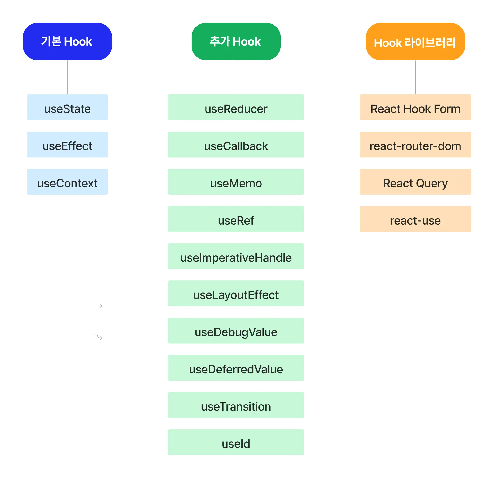

# 오류 수정

1. npm install uuid
2. Main 컴포넌트에 Button 컴포넌트 밑에
```jsx
    <main>
      <Button>레드벨벳 노래 찾기</Button>
      <Button>남자 아티스트 노래 찾기</Button>
      <Button>여자 아티스트 노래 찾기</Button>
      <KPopList />
    </main>
```
3. context.jsx

```jsx
  return (
    <KPopContext.Provider value={{data, playlist, setPlaylist}}>
      {children}
    </KPopContext.Provider>
  );
```

<KPopContextProvider value={{data, playlist, setPlaylist}}>
->
<KPopContext.Provider value={{data, playlist, setPlaylist}}>

# Hook

## 정의 

: Hook 은 함수 컴포넌트에서 상태 관리와 생명주기 기능을 연동할 수 있게 해주는 함수

함수 컴포넌트는 상태를 가질 수 없고, 메서드를 사용해 생명주기를 관리하는 것도 불가능. 기존에는 코드의 복잡성과 낮은 재사용성의 문제에도 불구하고 클래스 컴포넌트를 사용해야만 했습니다. 이후에 Hook이 등장하고, 효율적인 상태 관리 및 생명주기 기능을 사용할 수 있게 되었습니다.

